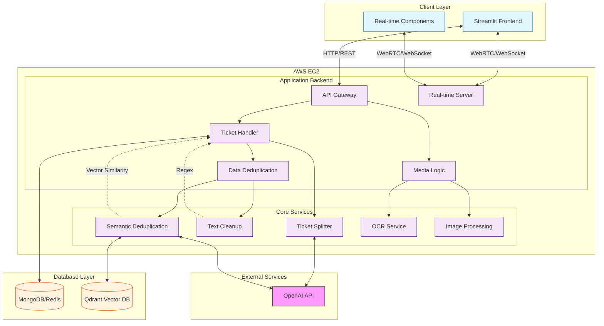

```mermaid
flowchart TB
    subgraph Client["Client Layer"]
        UI[Streamlit Frontend]
        RT[Real-time Components]
    end

    subgraph AWS["AWS EC2"]
        direction TB
        subgraph Backend["Application Backend"]
            API[API Gateway]
            TH[Ticket Handler]
            DD[Data Deduplication]
            ML[Media Logic]
            RT_BE[Real-time Server]
        end

        subgraph Services["Core Services"]
            TS[Ticket Splitter]
            TC[Text Cleanup]
            SD[Semantic Deduplication]
            OCR[OCR Service]
            IMG[Image Processing]
        end
    end

    subgraph Databases["Database Layer"]
        MDB[(MongoDB/Redis)]
        VDB[(Qdrant Vector DB)]
    end

    subgraph External["External Services"]
        OAI[OpenAI API]
        style OAI fill:#f9f,stroke:#333
    end

    %% Client Layer Connections
    UI <-->|HTTP/REST| API
    UI <-->|WebRTC/WebSocket| RT_BE
    RT <-->|WebRTC/WebSocket| RT_BE

    %% Backend Internal Connections
    API --> TH
    API --> ML
    TH --> DD
    TH --> TS
    ML --> OCR
    ML --> IMG

    %% Service Layer Connections
    DD --> TC
    DD --> SD
    TC -.->|Regex| TH
    SD -.->|Vector Similarity| TH

    %% Database Connections
    TH <--> MDB
    SD <--> VDB

    %% External Service Connections
    TS <--> OAI
    SD <--> OAI

    %% Styling
    classDef primary fill:#e1f5fe,stroke:#01579b
    classDef secondary fill:#f3e5f5,stroke:#4a148c
    classDef database fill:#fff3e0,stroke:#e65100
    classDef external fill:#f9f,stroke:#333

    class UI,RT primary
    class API,TH,DD,ML,RT_BE,TS,TC,SD,OCR,IMG secondary
    class MDB,VDB database
    class OAI external
```
