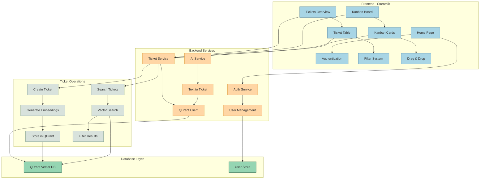

```mermaid
graph TD
    subgraph "Frontend - Streamlit"
        A[Home Page] --> D[Authentication]
        B[Tickets Overview] --> E[Ticket Table]
        C[Kanban Board] --> F[Kanban Cards]
        E --> G[Filter System]
        F --> H[Drag & Drop]
    end

    subgraph "Backend Services"
        I[Ticket Service] --> J[QDrant Client]
        K[Auth Service] --> L[User Management]
        M[AI Service] --> N[Text to Ticket]
    end

    subgraph "Database Layer"
        O[QDrant Vector DB]
        P[User Store]
    end

    %% Connect Frontend to Backend
    B --> I
    C --> I
    A --> K
    F --> I
    E --> I
    N --> J

    %% Connect Backend to Database
    J --> O
    L --> P

    %% Data Flow for Ticket Operations
    subgraph "Ticket Operations"
        Q[Create Ticket] --> R[Generate Embeddings]
        R --> S[Store in QDrant]
        T[Search Tickets] --> U[Vector Search]
        U --> V[Filter Results]
    end

    I --> Q
    I --> T
    S --> O
    U --> O

    %% Styling
    classDef frontend fill:#a8d5e5,stroke:#457b9d
    classDef backend fill:#ffd6a5,stroke:#e09f3e
    classDef database fill:#95d5b2,stroke:#2d6a4f
    classDef operations fill:#d8e2dc,stroke:#6b9080

    class A,B,C,D,E,F,G,H frontend
    class I,J,K,L,M,N backend
    class O,P database
    class Q,R,S,T,U,V operations
```
