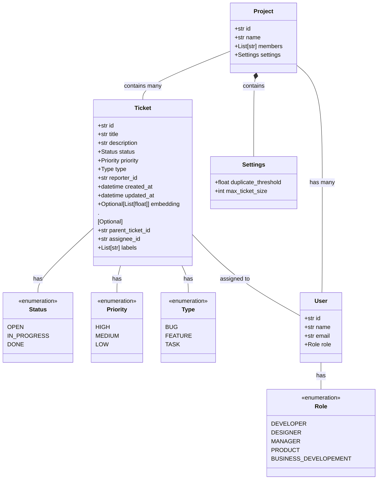

```mermaid
classDiagram
    class Status {
        <<enumeration>>
        OPEN
        IN_PROGRESS
        DONE
    }

    class Priority {
        <<enumeration>>
        HIGH
        MEDIUM
        LOW
    }

    class Type {
        <<enumeration>>
        BUG
        FEATURE
        TASK
    }

        class Role {
        <<enumeration>>
        DEVELOPER
        DESIGNER
        MANAGER
        PRODUCT
        BUSINESS_DEVELOPEMENT
    }


    class User {
        +str id
        +str name
        +str email
        +Role role
    }

    class Ticket {
        +str id
        +str title
        +str description
        +Status status
        +Priority priority
        +Type type
        +str reporter_id
        +datetime created_at
        +datetime updated_at
        +Optional[List[float]] embedding        
        .
        [Optional]
        +str parent_ticket_id
        +str assignee_id
        +List[str] labels
    }

    class Project {
        +str id
        +str name
        +List[str] members
        +Settings settings
    }

    class Settings {
        +float duplicate_threshold
        +int max_ticket_size
    }

    Project *-- Settings : contains
    Ticket -- Status : has
    Ticket -- Priority : has
    Ticket -- Type : has
    Project -- User : has many
    Project -- Ticket : contains many
    Ticket -- User : assigned to
    User -- Role : has
```
