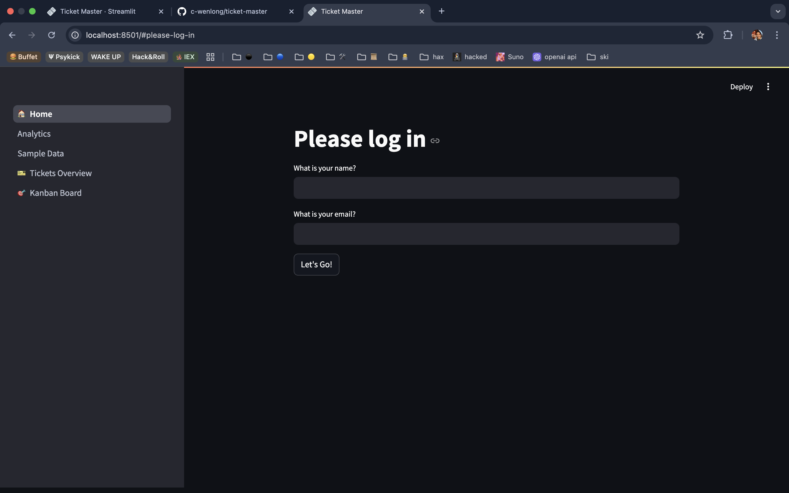
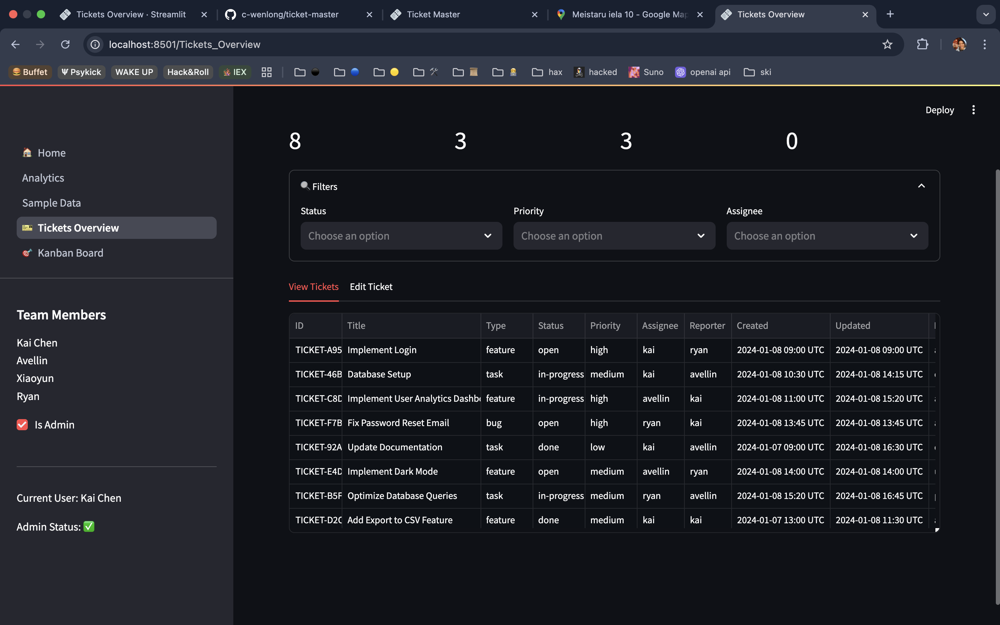
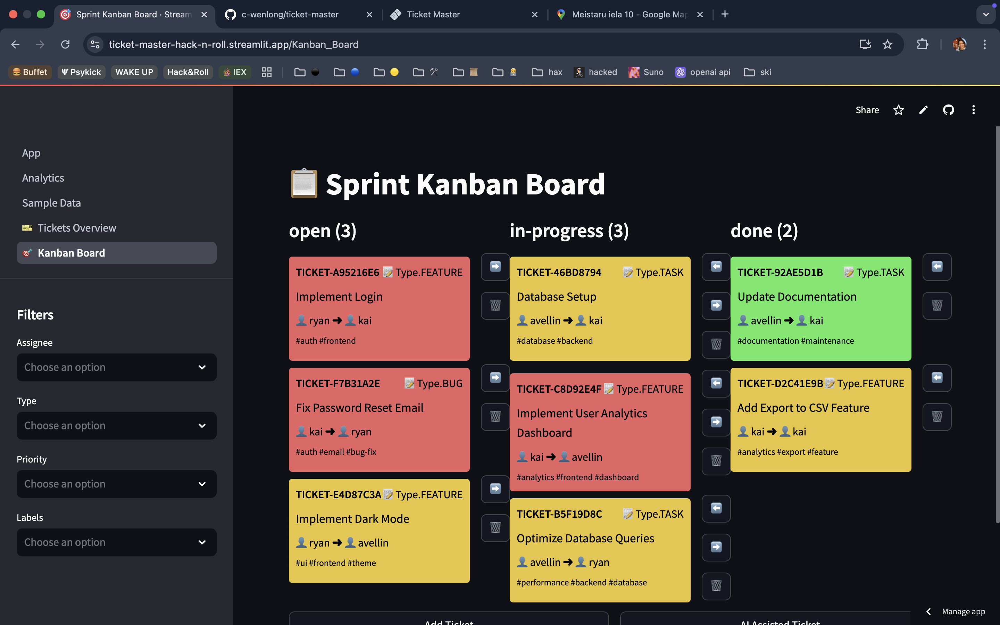

In the app, there is the:

1. Home Page
2. View Tickets
3. Kanban Board
4. Analytics

### Home



In home, I have implemented a simple login page, the auth states are hardcoded and is stored within `src/utils/sample_data.py`. This is what it looks like.

```json
SAMPLE_USERS = [
    User(**user_data)
    for user_data in [
        {
            "id": "USER-1",
            "name": "Kai Chen",
            "email": "chenwenlongofficial@gmail.com",
            "username": "kai",
            "role": "developer",
        },
        {
            "id": "USER-2",
            "name": "Avellin",
            "email": "avellin@gmail.com",
            "username": "avellin",
            "role": "developer",
        },
        {
            "id": "USER-3",
            "name": "Xiaoyun",
            "email": "xiaoyun@gmail.com",
            "username": "xiaoyun",
            "role": "developer",
        },
        {
            "id": "USER-4",
            "name": "Ryan",
            "email": "ryan@gmail.com",
            "username": "ryan",
            "role": "developer",
        },
    ]
]
```

The text boxes within the home page parses the name and email so make sure it is exactly the same as any of the auth states above, you can change this manually within the hard-coded file.

### View Tickets



In view tickets, there are 2 tabs, one is to view tickets, editing is not supported, if you want to edit, you have to switch to the other tab. Then once done editing just press submit, it should sync with the kanban board.

Note for the demo, show the filters also because its an useful feature. You can also see the team members and who the currently logged in as.

### Kanban Board



For the Kanban board, it is already synced with the view all tickets page using the `st.session_state.tickets`, for manipulation of the tickets, please follow the emojis, the left and right arrows allow you to move the tickets left and right and the trash bin deletes the ticket.

Note that the color is representing the priority of the ticket, mention this in the demo.Also, there are filters on the sidebar for you to filter the tickets by.
